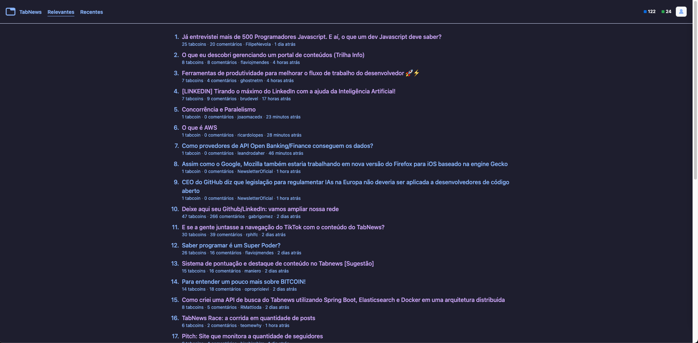
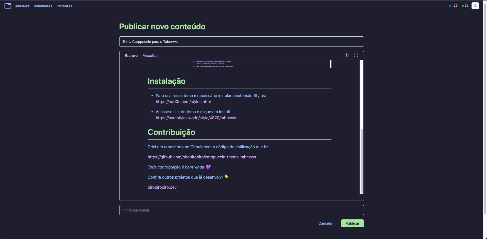

<h3 align="center">
	 
	
	Catppuccin for <a href="https://www.tabnews.com.br/">Tabnews</a>
	
</h3>

    
    
    

  

  

## Usage

1. Install Stylus extension for [Firefox](https://addons.mozilla.org/en-US/firefox/addon/styl-us/), [Chrome](https://chrome.google.com/webstore/detail/stylus/clngdbkpkpeebahjckkjfobafhncgmne) or [Opera](https://addons.opera.com/en-gb/extensions/details/stylus/)
2. Then install with Stylus (click on the link):

- [🌿 Catppuccin Mocha](https://userstyles.world/style/4820/tabnews-catppuccin-mocha)

Copyright &copy; 2021-present <a href="https://github.com/catppuccin" target="_blank">Catppuccin Org</a>
